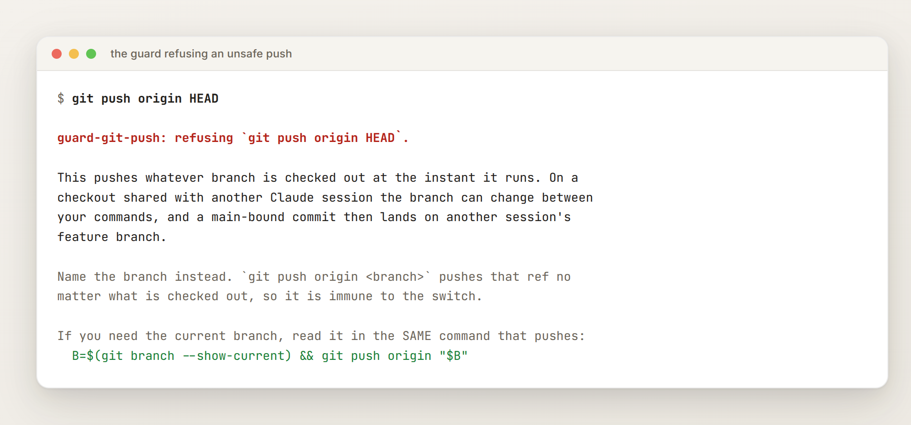
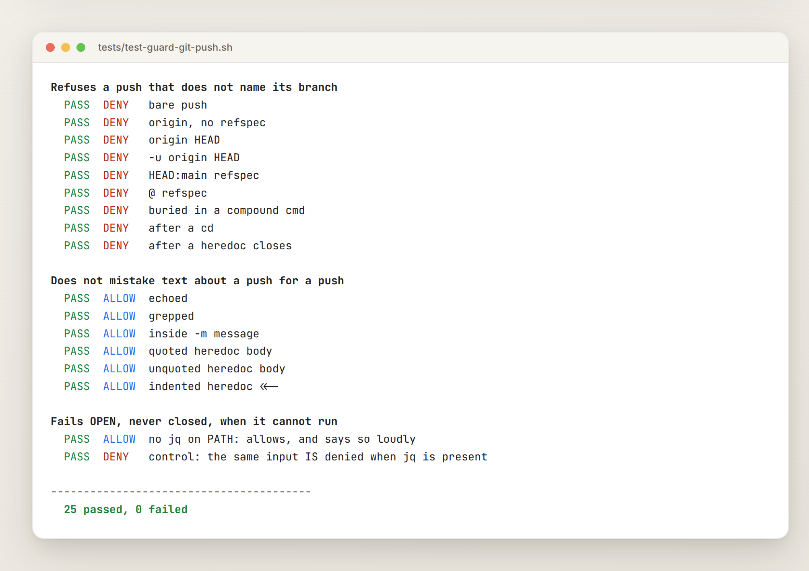
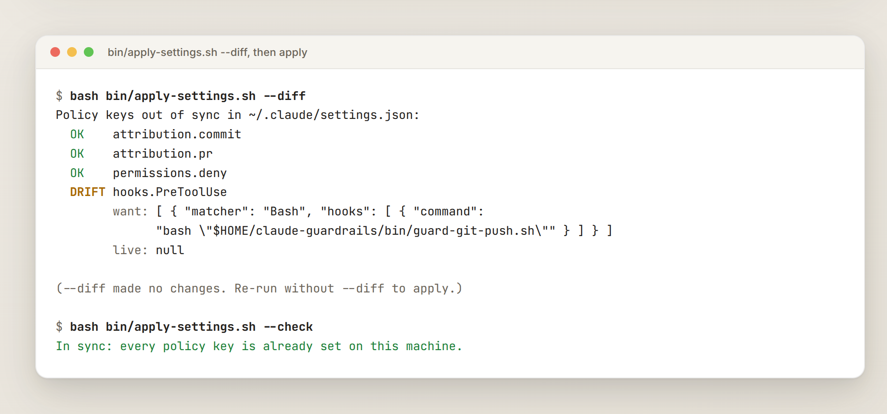

# claude-guardrails


**TL;DR:** an instruction telling an AI coding assistant "always check X before doing Y"
is not a control. It is a hope. This repository is the part of one person's Claude Code
configuration that stopped being hopes and became **mechanisms**: a `PreToolUse` hook that
refuses a dangerous command outright, a settings policy that reapplies itself and reports
drift per key, and a set of instruction files whose rules were each earned by an actual
outage. Take the whole thing, or steal the one file you need.

The worked example, and the reason this exists: an instruction said *re-check the branch
before you push*. Two Claude sessions shared one checkout, one switched branches between
the other's tool calls, and a main-bound commit landed on the wrong branch. The instruction
failed exactly as written. So it was replaced with a hook that cannot forget.

**[Save me the chit chat: show me how to install it →](#install)**

<picture><source media="(prefers-color-scheme: dark)" srcset="docs/images/guard-dark.png"></picture>

## What is in here

| Piece | What it does |
|---|---|
| `bin/guard-git-push.sh` | `PreToolUse` hook. Refuses a `git push` that does not name its branch. |
| `bin/guard-repo-collision.sh` | `PreToolUse` hook. Warns, once per session, when another Claude session is running in the same checkout. |
| `bin/apply-settings.sh` | Merges a policy into `~/.claude/settings.json`, reports drift per key, and reapplies itself from a `SessionStart` hook. |
| `bin/check-setup.sh` | Machine-level preflight: stow links resolve, settings policy in force, commit identity not leaking a personal address. |
| `claude-core/.claude/instructions/` | The rules themselves: five laws, twelve anti-silent-failure rules with their case studies, working style, session discipline, security. |
| `claude-commands/.claude/commands/` | Slash commands: `/session-end`, `/next-session`, `/nextlite`, `/new-repo`, `/setup-issues`. |
| `claude-coding/.claude/skills/` | Skills for general coding work. |
| `tests/` | 52 cases across both guards, classified against the real hook contract. |

## The idea

Three ideas, and they are the whole repository.

**1. If a rule matters, make the harness enforce it.** An instruction file is read by a
model that is doing something else at the time. A hook runs every time, whether anyone
remembered or not. Every rule here that could become a mechanism has.

**2. A check must be able to tell "passed" from "could not run".** The expensive bugs
were never crashes. They were a protection that died quietly and looked exactly like a
healthy one: a green tick over a machine that had stopped doing its job. So checks here
return a tri-state, and a check that could not run says so instead of returning "fine".

**3. Prove the mechanism, do not assert it.** Every guard here ships with the test that
demonstrates it fires, *and* a control that demonstrates the test could have failed.

## Install

Requires `bash`, `jq`, and [GNU Stow](https://www.gnu.org/software/stow/) if you want the
instruction files symlinked rather than copied.

```sh
git clone https://github.com/rodlunt/claude-guardrails ~/claude-guardrails
cd ~/claude-guardrails

# 1. Symlink the instruction files, commands and skills into ~/.claude
stow --target="$HOME" claude-core claude-commands claude-coding

# 2. Merge the settings policy into this machine's live settings.json
bash bin/apply-settings.sh
```

That second step is what installs the hooks. `settings.json` is deliberately **not**
stowed: Claude Code rewrites it at runtime, so a symlink into a repository would be
clobbered or written through.

Want only the hook and none of the opinions? Copy `bin/guard-git-push.sh` anywhere and
add this to your own `settings.json`:

```json
{
  "hooks": {
    "PreToolUse": [
      {
        "matcher": "Bash",
        "hooks": [
          { "type": "command", "command": "bash \"$HOME/path/to/guard-git-push.sh\"", "timeout": 10 }
        ]
      }
    ]
  }
}
```

## The push guard

It denies a push that does not name the branch it is pushing:

| Denied | Allowed |
|---|---|
| `git push` | `git push origin main` |
| `git push origin` | `git push -u origin feat/thing` |
| `git push origin HEAD` | `B=$(git branch --show-current) && git push origin "$B"` |
| `git push origin HEAD:main` | `git push origin main --dry-run` |
| `git push origin @` | `git -C /path push origin main` |

`git push origin <branch>` pushes that ref no matter what is checked out, so it is immune
to another session switching the tree underneath you. The `HEAD` and bare forms are not.

Two design decisions are worth knowing before you adapt it.

**It matches the whole command, not the hook's `if` key.** The obvious configuration is
`"if": "Bash(git push *)"`. It would not have caught the incident that prompted this,
because permission rules anchor at the **start** of the command and that one began with
`git add`. So the script splits the command on `&&`, `||`, `;`, pipes and newlines and
examines each segment. It also strips heredoc bodies first, because the commit message
documenting the bug quoted the unsafe command, and a guard that cannot tell an invocation
from a sentence describing one would make the incident undocumentable.

**It fails open, loudly.** No `jq`, or an unreadable payload, and the call is allowed with
a warning on stderr and in a `systemMessage`. Blocking every Bash call on a machine
without `jq` would be worse than the bug it prevents. Silence is the one outcome it never
produces.

<picture><source media="(prefers-color-scheme: dark)" srcset="docs/images/tests-dark.png"></picture>

The last two lines of that run are the ones that matter. The guard is checked for failing
**open** when `jq` is missing, and then a control proves the same input is still denied
when `jq` is present. Without the control, "it allowed the push" would also be true of a
guard that allows everything.

## The collision guard

The push guard blocks the one command whose damage is hard to undo. It cannot tell you the
fact underneath: that somebody else is in the checkout with you. That is what
`bin/guard-repo-collision.sh` is for.

It fires only on git verbs that **write** (`commit`, `merge`, `rebase`, `push`, `checkout`,
`switch`, `reset`, `cherry-pick`, `stash`), warns **once per session per repository**, and
**never blocks**:

```text
guard-repo-collision: another Claude Code session is running in this same checkout.

  repo:   /home/you/Projects/thing
  branch: main (right now, and it can change under you)
  peers:  pid 237453

The branch can change between two of your tool calls. Do not read it once and rely on it later.
  - Name branches explicitly: `git push origin <branch>`, never HEAD or a bare push.
  - Re-read the branch in the SAME command that uses it.
  - Consider ListAgents and SendMessage to tell the peer what you are about to do.
  - If you are about to do sustained work, relaunching under --worktree avoids this entirely.
```

Three deliberate decisions:

- **`PreToolUse`, not `SessionStart`.** A start-up check only sees peers that already exist.
  The second collision that prompted this happened when a peer branched *after* the session
  had started, which a start-up warning would have missed entirely.
- **Warns, does not block.** The push guard already refuses the dangerous form. Blocking
  every git command whenever a colleague is in the same repo would be unusable, and a
  warning on `git status` is a warning you stop reading.
- **It cannot call `SendMessage` itself.** Hooks are shell commands; `SendMessage` is a tool
  available to the model. So the hook supplies the fact and tells the model to use it.

Its test suite states its own gap rather than hiding it: the peer-present path needs a
second real Claude session in the same checkout, which CI cannot spawn, so that path is
verified by hand and the expected output is printed in the suite for comparison.

## The settings policy

`~/.claude/settings.json` cannot live in a dotfiles repository, because Claude Code
rewrites it. But a few settings are load-bearing: an instruction file relies on the
harness enforcing them rather than on the assistant complying. Those live in
`claude-core/settings-policy.json` and are merged in by `bin/apply-settings.sh`.

```sh
bash bin/apply-settings.sh          # merge the policy into this machine
bash bin/apply-settings.sh --check  # exit 1 on drift, 2 if it could not run
bash bin/apply-settings.sh --diff   # show what would change, write nothing
bash bin/apply-settings.sh --heal   # what the SessionStart hook runs
```

<picture><source media="(prefers-color-scheme: dark)" srcset="docs/images/policy-dark.png"></picture>

Details that are easy to get wrong, and are why this is a script rather than a README
instruction:

- **Arrays are unioned, not replaced.** `jq`'s `*` operator replaces them, which would
  silently delete any deny rule a machine had added locally. Silently removing a security
  rule while reporting success is the exact bug this whole repository is about.
- **Drift is reported at leaf path**, so you see `permissions.deny`, not a dump of the
  whole `permissions` object with the one changed line buried in it.
- **The exit codes distinguish three states.** `0` in sync, `1` drift, `2` could not run.
  A caller must be able to tell "checked and clean" from "never actually checked".
- **The policy reapplies itself** from a `SessionStart` hook, so a machine self-heals
  instead of depending on someone remembering to run the script. It cannot install itself,
  though, so a new machine still needs one manual run.

## The rules

`claude-core/.claude/instructions/` is the part you can read in ten minutes and argue with.

- **[five-laws.md](claude-core/.claude/instructions/five-laws.md)** — unknown is a valid
  answer; verify and prove; push back or be complicit; declare confidence; structure over
  promises. Written to counteract a model's trained pull toward sounding confident and
  agreeable.
- **[hardening.md](claude-core/.claude/instructions/hardening.md)** — twelve rules about
  safety mechanisms that die quietly. Never renumber them; they are cited by number.
- **[hardening/cases.md](claude-core/.claude/instructions/hardening/cases.md)** — the
  outage behind each rule. A one-line rule is easy to misapply; the case is what makes it
  stick.
- **[working-style.md](claude-core/.claude/instructions/working-style.md)** — branch and
  PR discipline, conventional commits, never squash-merge, and the push rule the hook
  enforces.
- **[session-discipline.md](claude-core/.claude/instructions/session-discipline.md)**,
  **[security.md](claude-core/.claude/instructions/security.md)**,
  **[environment.md](claude-core/.claude/instructions/environment.md)**.

## What this is not

- **Not a framework.** There is nothing to extend. Copy what is useful.
- **Not complete.** This is a deliberately sanitised subset of a private repository.
  Machine inventories, network topology and personal workflow files are not here and will
  not be added.
- **Not a substitute for isolating sessions.** Claude Code does not detect two interactive
  sessions sharing a checkout, and neither does this. Only *background* sessions get an
  automatic worktree; interactive ones need an explicit `--worktree`. The guard is a
  seatbelt for one common consequence, not prevention.
- **Not enforcement against you.** Hooks constrain the assistant. Your own terminal is
  untouched.

## Development

```sh
tests/test-guard-git-push.sh                      # 25 cases
tests/test-guard-repo-collision.sh                # 27 cases
shellcheck -S warning bin/*.sh tests/*.sh
jq empty claude-core/settings-policy.json
```

CI runs all of the above, plus a check that both guards are still executable, because a
hook whose script has lost its exec bit fails in exactly the quiet way this repository is
about.

See [CONTRIBUTING.md](CONTRIBUTING.md). The bar for a new guard is that it can tell
"passed" from "could not run".

## Licence

[MIT](LICENSE).
